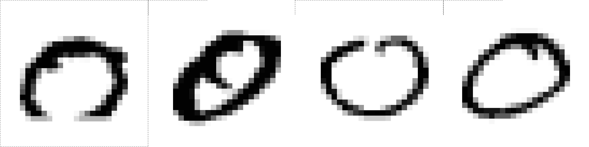
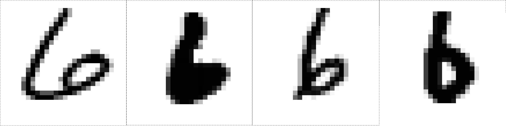
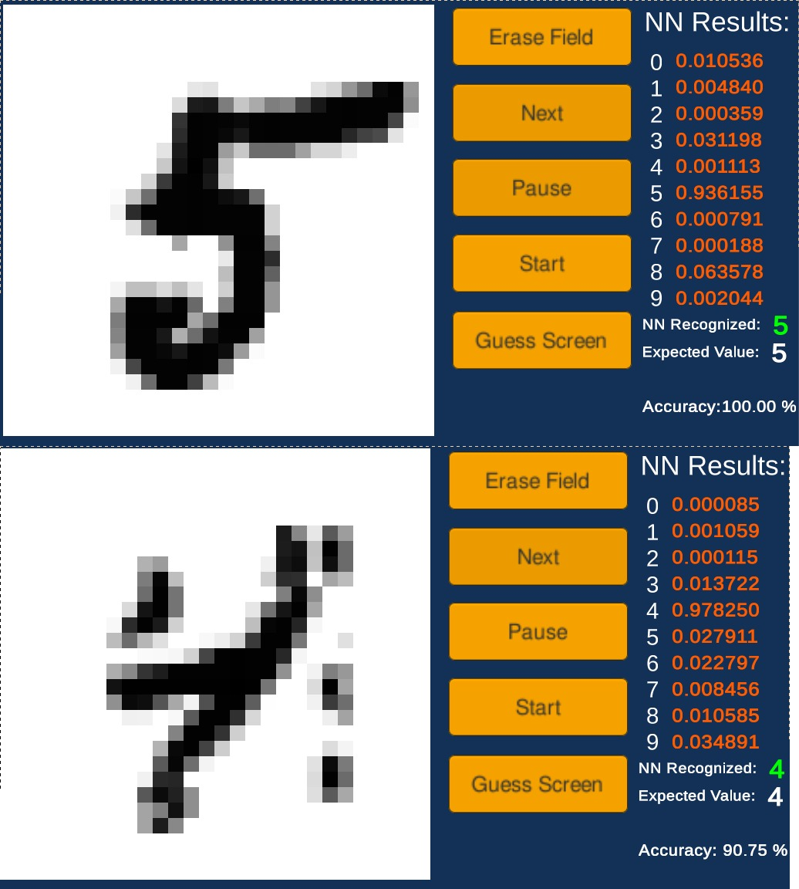
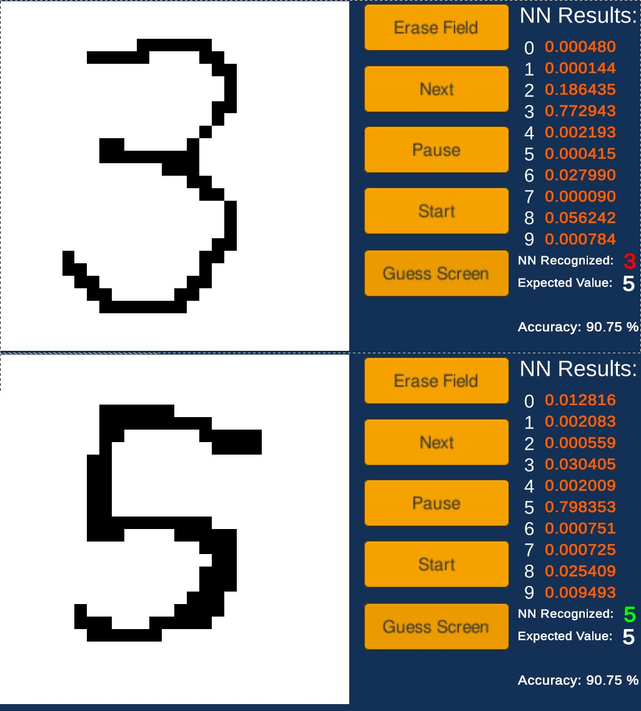

# Unity Number Recognition
Number recognition done with a neural network. Made in Unity/C#.

This project was inspired by the 3Blue1Brown's video titled: [But what is a neural network? | Chapter 1, Deep learning](https://youtu.be/aircAruvnKk).
In that video he explains the mathematics behind the neural networks using the simple dense deep network with a 16-16-10 structure.
This means that the network has two hidden layes each 16 neuron big, and the output layer is 10 neuron big which corresponds to the number of digits.
I went on to recreate the mathematics inside Unity using the C# programming language. I chose Unity as I was into game development at the time, and I wanted to experiment with a nice GUI. A neural network is created as a series of float arrays which contain the values of all the weights and biases.

The dataset used for training and testing is the MNIST digits dataset. The website from where the original dataset is available seems to be locked, but a subset of it is available on Kaggle:
[MNIST from Kaggle](https://www.kaggle.com/datasets/hojjatk/mnist-dataset)

Here are some examples of the images of the digits inside the dataset. The digits are handwritten and some are quite flawed, as seen in the examples below. This makes the task more challenging, but also makes the NN more robust. Nevertheless, the challenge is quite easy.

Here are some zeroes:

And here are the examples of the number six:

Now below is the GUI in Unity. To the left you can see the white rectangle inside which the number is displayed. There is the button "Erase Field" which erases the digit, after which you can write your own digit. You can also add pixels to the digit from the dataset and test how much it affects the NN results. Use the button "Guess Screen" to predict on the drawn digit.

Button "Next" cycles the next digit from the dataset. Button "Start" starts the training cycle and each digit is displayed on the screen. Button "Pause" pauses the training.

On the right of the screen activations for each output is listed. In other words, the number mean how sure the NN is that the written digit is a certain digit. Predicted and expected digit are listed below, as well as NN accuracy.

Here are some examples of the NN predicting on digits from the MNIST dataset:

And here are some examples of the NN predicting on newly written digits, ignore the "Expected Value" here: 

The NN is trained successfully and is able to classify user written digits.
